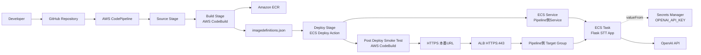

# Architecture

## 位置づけ

このアーキテクチャは、STT + ECS / Phase 1で構築した既存アプリに対するCI/CD基盤移行を示すものです。

Phase 1では、AI音声文字起こしアプリをECS、ALB、Secrets Manager上で動かす構成を整理しました。

Phase 2では、その既存アプリに対して、GitHub Actions経路とCodePipeline経路を分離し、段階的に本番入口を切り替えました。

## 移行前

移行前は、GitHub Actionsによるデプロイ経路でECS Serviceを更新していました。

本番入口であるHTTPS:443は、Actions側のTarget Groupへ向いていました。

```text
User
  ↓ HTTPS:443
ALB
  ↓
Actions側 Target Group
  ↓
Actions側 ECS Service
  ↓
STT Flask App
  ↓
OpenAI API
```

## 事前検証時

CodePipeline側のECS Serviceを新規に作成し、Actions側Serviceとは別のTarget Groupに紐づけました。

本番入口であるHTTPS:443は既存のActions側Target Groupへ向けたまま、HTTP:81の一時的な検証用ListenerをPipeline側Target Groupへ向けました。

```text
本番アクセス
  ↓ HTTPS:443
ALB
  ↓
Actions側 Target Group
  ↓
Actions側 ECS Service
```

```text
検証アクセス
  ↓ HTTP:81
ALB
  ↓
Pipeline側 Target Group
  ↓
Pipeline側 ECS Service
```

この構成により、ユーザー向けの本番入口を維持したまま、新しいPipeline側Serviceの画面表示とSTT API応答を確認しました。

## 切替時

切替時には、ALB Fixed responseを利用して一時的なメンテナンス表示を返しました。

これは、ユーザーが古い経路と新しい経路の中途半端な状態を見ることを避けるためです。

その後、HTTPS:443の転送先をActions側Target GroupからPipeline側Target Groupへ変更しました。

## 切替後

切替後は、HTTPS:443がPipeline側Target Groupへ向く構成になりました。

```text
User
  ↓ HTTPS:443
ALB
  ↓
Pipeline側 Target Group
  ↓
Pipeline側 ECS Service
  ↓
STT Flask App
  ↓
OpenAI API
```

## CodePipelineとSmoke Testの流れ

切替後は、CodePipelineのDeploy成功だけで完了とせず、CodeBuildから本番URLへSmoke Testを実行しました。

Smoke Testでは、ECS Task上のアプリがSecrets ManagerからAPIキーを受け取り、OpenAI API連携まで正常に行えることを確認しました。



この構成では、Smoke Testが直接Secretの値を見るのではなく、本番URL経由でSTT APIを実行します。アプリがOpenAI API連携まで成功することで、Secrets ManagerからECS TaskへのAPIキー注入も含めて確認しています。

## 補足

この構成は、CodeDeployを使った厳密なBlue/Green Deployではありません。

今回の目的は、学習・検証環境において、コストと構成複雑性を抑えながら、ユーザー影響を限定し、切り戻し可能なCI/CD移行を行うことでした。

そのため、Target Group分離、一時的な検証用Listener、ALB Fixed response、本番URL Smoke Testを組み合わせた段階移行として設計しました。
