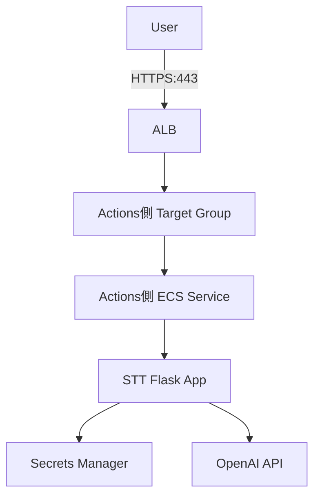
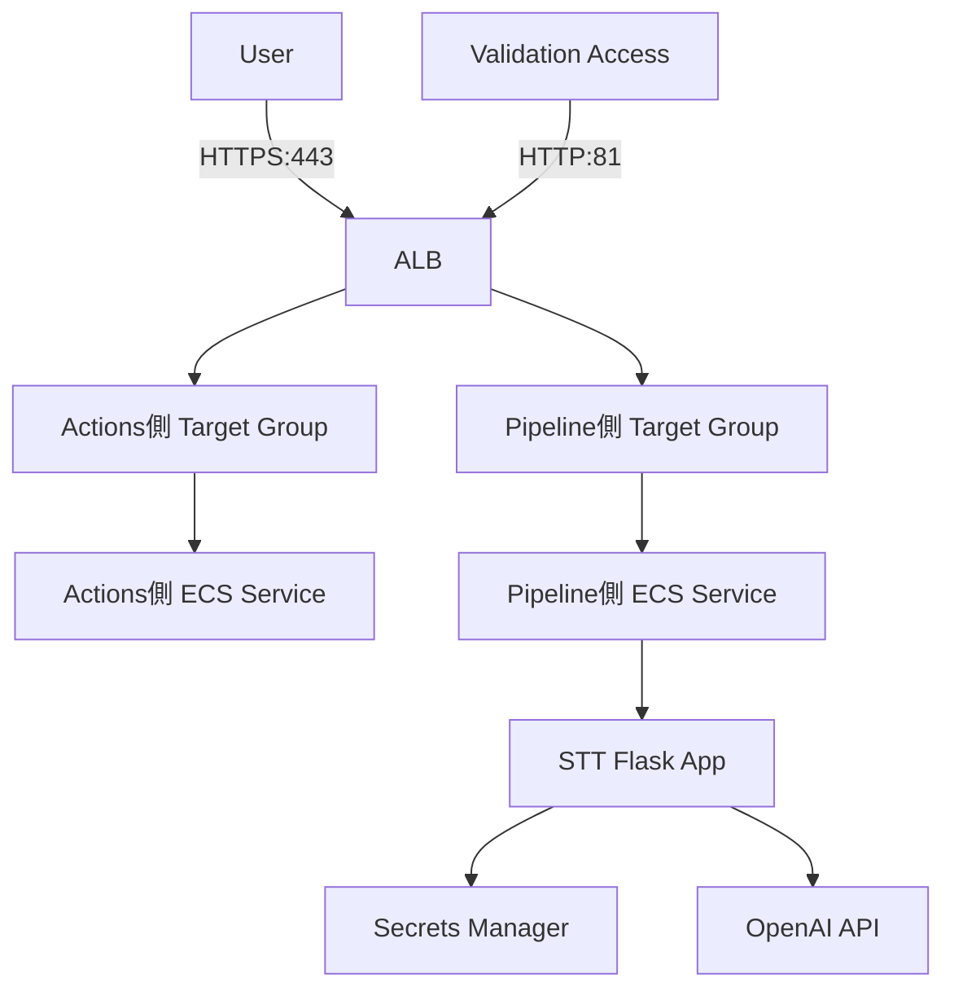
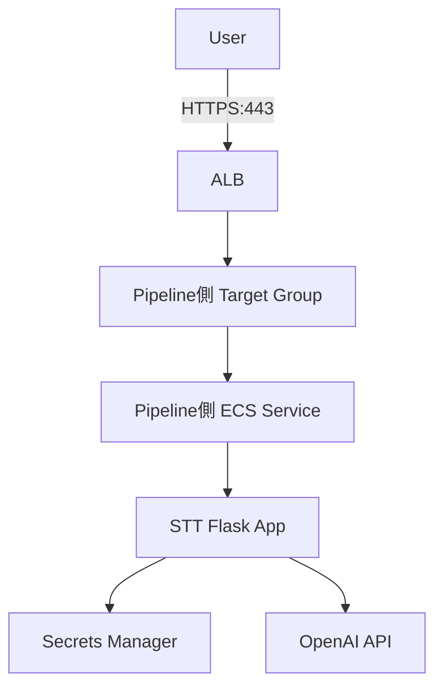
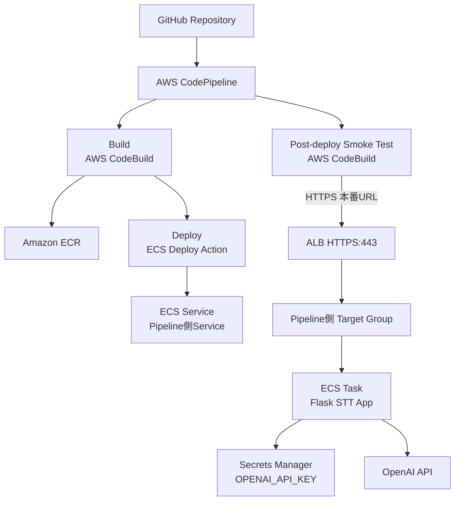

# Architecture

## 位置づけ

このアーキテクチャは、STT + ECS / Phase 1で構築した既存アプリに対するCI/CD基盤移行を示すものです。

Phase 1では、AI音声文字起こしアプリをECS、ALB、Secrets Manager上で動かす構成を整理しました。

Phase 2では、その既存アプリに対して、GitHub Actions経路とCodePipeline経路を分離し、段階的に本番入口を切り替えました。

## 1. 移行前: GitHub Actions側が本番入口を受けているPhase 1 状態

移行前は、GitHub Actionsによるデプロイ経路でECS Serviceを更新していました。

本番入口であるHTTPS:443は、Actions側Target Groupへ向いていました。

この時点では、ユーザー向けの本番経路は既存のGitHub Actions側Serviceで処理していました。

## 2. 移行前検証: HTTP:81でPipeline側を事前確認

CodePipeline側のECS Serviceを新規に作成し、Actions側Serviceとは別のTarget Groupに紐づけました。

本番入口であるHTTPS:443は既存のActions側Target Groupへ向けたまま、HTTP:81の一時的な検証用ListenerをPipeline側Target Groupへ向けました。

この構成により、ユーザー向けの本番入口を維持したまま、新しいPipeline側Serviceの画面表示とSTT API応答を確認しました。

HTTP:81は移行作業中だけ使う一時的な検証用Listenerであり、移行完了後に閉鎖しました。

## 3. CI/CD基盤移行後: 本番HTTPS:443をPipeline側へ切り替える

Pipeline側の事前確認後、切替時にはALB Fixed responseを利用して一時的なメンテナンス表示を返しました。

これは、ユーザーが古い経路と新しい経路の中途半端な状態を見ることを避けるためです。

その後、HTTPS:443の転送先をActions側Target GroupからPipeline側Target Groupへ変更しました。

切替後は、ユーザー向けの本番経路がCodePipeline側Serviceへ向く構成になりました。

## 4. Smoke Test実施: 本番URL経由でユーザー経路を確認する

切替後は、CodePipelineのDeploy成功だけで完了とせず、CodeBuildから本番URLへSmoke Testを実行しました。

Smoke Testでは、ECS Task上のアプリがSecrets ManagerからAPIキーを受け取り、OpenAI API連携まで正常に行えることを確認しました。

このSmoke Testは、Secretの値を直接確認するものではありません。

本番URL経由でSTT APIが成功することで、以下が成立していることを確認しています。

- ALB HTTPS:443 がPipeline側Target Groupへ転送していること
- Pipeline側Target Groupに正常なECS Taskが登録されていること
- ECS Task上でFlaskアプリが起動していること
- Secrets ManagerからAPIキーがECS Taskへ注入されていること
- アプリがOpenAI APIへリクエストできること
- STT APIが期待した応答を返すこと

## 補足

この構成は、CodeDeployを使った厳密なBlue/Green Deployではありません。

今回の目的は、学習・検証環境において、コストと構成複雑性を抑えながら、ユーザー影響を限定し、切り戻し可能なCI/CD移行を行うことでした。

そのため、Target Group分離、一時的な検証用Listener、ALB Fixed response、本番URL Smoke Testを組み合わせた段階移行として設計しました。
